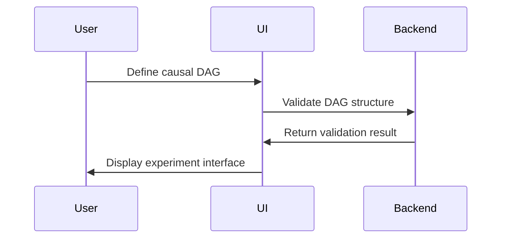
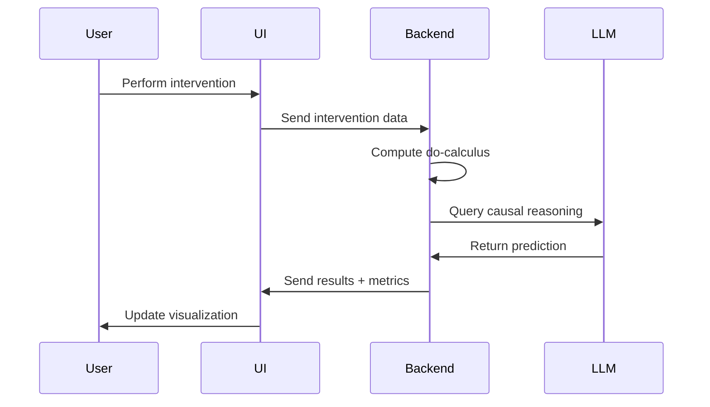

# Architecture Overview

Causal UI Gym is a framework for testing LLM causal reasoning through interactive UI components.

## High-Level Architecture

```
┌─────────────────┐     ┌──────────────┐     ┌─────────────────┐
│   Figma Plugin  │────▶│  Converter   │────▶│ React Component │
│                 │     │              │     │   + Causal DAG  │
└─────────────────┘     └──────────────┘     └─────────────────┘
                                                      │
                               ┌──────────────────────┘
                               ▼
┌─────────────────┐     ┌──────────────┐     ┌─────────────────┐
│   JAX Backend   │◀────│ Intervention │◀────│   User/LLM      │
│ (Do-Calculus)   │     │   Tracker    │     │   Interaction   │
└─────────────────┘     └──────────────┘     └─────────────────┘
```

## Component Architecture

### Frontend (React + TypeScript)

```
src/
├── components/
│   ├── CausalGraph/        # Interactive DAG visualization with D3.js
│   ├── InterventionPanel/  # UI controls for causal interventions
│   ├── MetricsDashboard/   # Real-time causal metrics visualization
│   ├── BeliefTracker/      # LLM belief state visualization
│   ├── ExperimentSetup/    # Experiment configuration interface
│   └── Templates/          # Pre-built experiment templates
├── models/
│   ├── CausalModel.ts     # Core causal model classes
│   ├── Experiment.ts      # Experiment configuration models
│   └── Agent.ts           # LLM agent state models
├── services/
│   ├── CausalService.ts   # Frontend causal computation service
│   ├── APIService.ts      # Backend API communication
│   └── ExperimentService.ts # Experiment management
├── types/
│   ├── causal.ts          # Causal model type definitions
│   ├── experiment.ts      # Experiment configuration types
│   ├── llm.ts             # LLM agent interface types
│   └── metrics.ts         # Metrics and analysis types
└── utils/
    ├── causal.ts          # Causal inference utilities
    ├── visualization.ts   # D3.js visualization helpers
    ├── metrics.ts         # Metric calculation functions
    └── validation.ts      # Input validation utilities
```

### Backend (JAX + FastAPI + Python)

```
backend/
├── engine/
│   ├── causal_engine.py   # Core JAX-based do-calculus implementation
│   ├── inference.py       # Bayesian inference with JAX
│   ├── dag_operations.py  # Graph manipulation and validation
│   ├── interventions.py   # Intervention computation algorithms
│   └── metrics.py         # Causal metrics (ATE, backdoor, etc.)
├── models/
│   ├── causal_models.py   # Pydantic models for causal structures
│   ├── experiment_models.py # Experiment configuration models
│   └── agent_models.py    # LLM agent interaction models
├── agents/
│   ├── base_agent.py      # Abstract LLM agent interface
│   ├── openai_agent.py    # OpenAI GPT integration
│   ├── anthropic_agent.py # Anthropic Claude integration
│   └── agent_factory.py   # Agent instantiation and management
├── services/
│   ├── experiment_service.py # Experiment lifecycle management
│   ├── intervention_service.py # Intervention processing service
│   ├── metrics_service.py # Metrics calculation service
│   └── agent_service.py   # LLM agent orchestration
├── repositories/
│   ├── experiment_repo.py # Experiment data persistence
│   ├── intervention_repo.py # Intervention history storage
│   └── metrics_repo.py    # Metrics data storage
└── api/
    ├── server.py          # FastAPI application setup
    ├── routes/
    │   ├── experiments.py # Experiment management endpoints
    │   ├── interventions.py # Intervention processing endpoints
    │   ├── agents.py      # LLM agent interaction endpoints
    │   └── metrics.py     # Metrics retrieval endpoints
    ├── middleware/
    │   ├── auth.py        # Authentication middleware
    │   ├── cors.py        # CORS configuration
    │   └── rate_limit.py  # Rate limiting middleware
    └── dependencies.py    # FastAPI dependency injection
```

## Data Flow

### 1. Experiment Setup



### 2. Intervention Processing



## Key Design Principles

### 1. Modularity
- Components are self-contained and reusable
- Clear separation between UI, logic, and computation
- Plugin architecture for extending functionality

### 2. Performance
- JAX JIT compilation for fast causal computations
- React memoization for efficient re-renders
- WebGL acceleration for large graph visualizations

### 3. Extensibility
- Support for custom causal models
- Pluggable LLM agent implementations
- Configurable experiment templates

### 4. Type Safety
- Full TypeScript coverage in frontend
- Pydantic models for backend validation
- Runtime type checking at API boundaries

## State Management

### Frontend State

```typescript
interface AppState {
  experiment: ExperimentConfig
  causalDAG: CausalDAG
  interventions: Intervention[]
  metrics: CausalMetrics
  llmBeliefs: BeliefState[]
}
```

### Backend State

```python
class ExperimentSession:
    def __init__(self):
        self.dag: CausalDAG = None
        self.intervention_history: List[Intervention] = []
        self.agent_states: Dict[str, AgentState] = {}
        self.metrics: MetricsCollector = MetricsCollector()
```

## API Design

### REST Endpoints

```
POST /api/experiments/          # Create new experiment
GET  /api/experiments/{id}      # Get experiment details
POST /api/interventions/        # Perform intervention
GET  /api/metrics/{id}          # Get causal metrics
POST /api/agents/query          # Query LLM agent
WS   /api/experiments/{id}/ws   # Real-time updates
```

### WebSocket Events

```typescript
interface WSEvents {
  'intervention_performed': InterventionEvent
  'metrics_updated': MetricsEvent
  'agent_response': AgentResponseEvent
  'graph_updated': GraphUpdateEvent
}
```

## Security Considerations

- Input validation for all causal model parameters
- Rate limiting for LLM API calls
- Sanitization of user-generated experiment configurations
- Secure handling of API keys and credentials

## Performance Optimization

### Frontend
- Virtual scrolling for large node lists
- Canvas-based rendering for complex graphs
- Debounced intervention updates
- Memoized causal calculations

### Backend
- JAX JIT compilation for numerical operations
- Caching of frequently computed interventions
- Batch processing of multiple agent queries
- Connection pooling for database operations

## Testing Strategy

### Unit Tests
- Component rendering and behavior
- Causal computation accuracy
- Utility function correctness

### Integration Tests
- API endpoint functionality
- Database operations
- LLM agent integration

### E2E Tests
- Complete experiment workflows
- Cross-browser compatibility
- Performance benchmarks

## Deployment Architecture

```
┌───────────────────┐   ┌───────────────────┐
│ Frontend (Vercel)    │   │ Backend (Modal)     │
│ - React SPA          │   │ - JAX Computation   │
│ - CDN Distribution   │   │ - GPU Acceleration  │
│ - Edge Caching       │   │ - Auto Scaling      │
└───────────────────┘   └───────────────────┘
```

This architecture ensures scalability, maintainability, and performance while supporting the complex requirements of causal reasoning experiments.